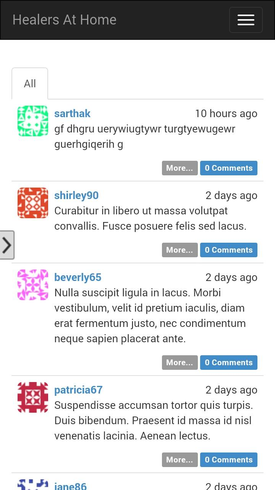
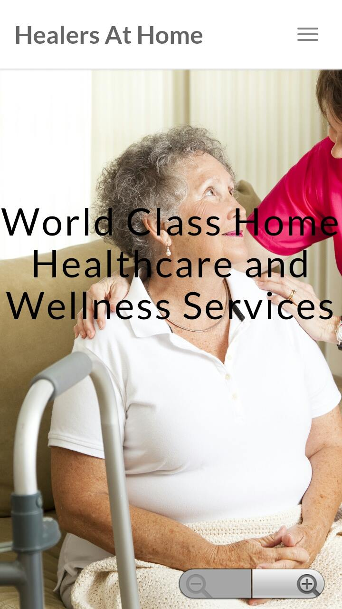
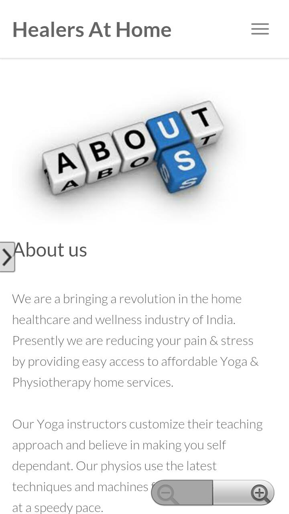
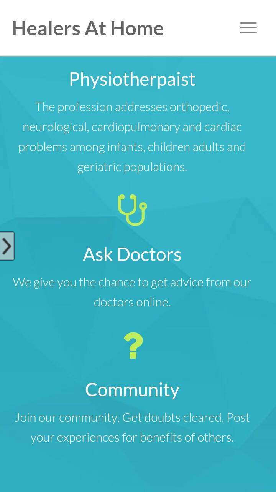
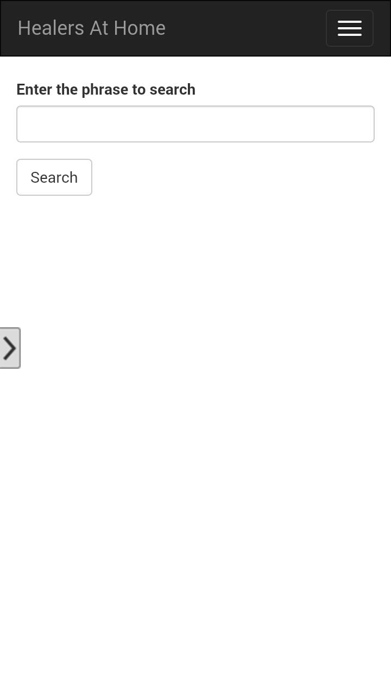
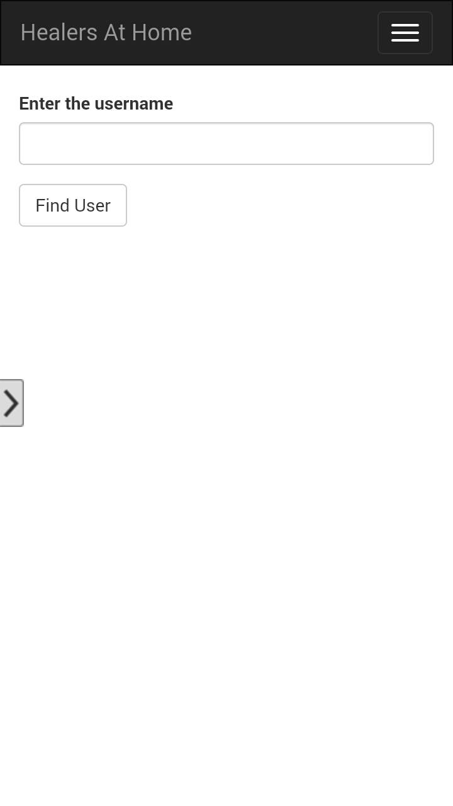
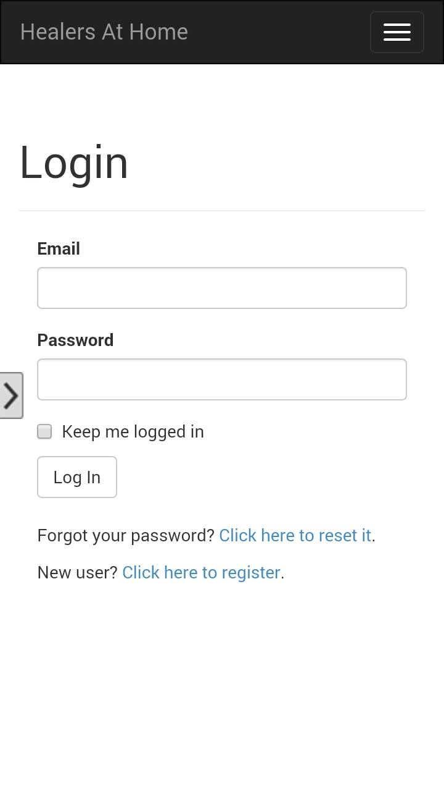

#Android-Application

<strong>PROBLEM STATEMENT:</strong>
 
Design and develop a utility Android app that people would love to use regularly to keep 

themselves healthy and fit. It can be something which:
 
<ol>
<li>Useful to people who need Physiotherapy or Yoga at home services</li>

<li>Useful to people in general who need Home Healthcare or Wellness services</li>

<li>Generic health / wellness related but extremely useful .Something which is needed 

on a daily basis. For eg. Whatsapp is needed by everyone on a daily basis. Similarly, 

this app will be needed by everyone around the world on a daily basis.</li>
</ol>

<strong> PROPOSED SOLUTION </strong>
 
A crowd source platform to increase the engagement with the app and website which follows the revolutionary model of advertisement.
 
Some screenshots are shown below:
 

 

 

 

 

 

 

 

 

